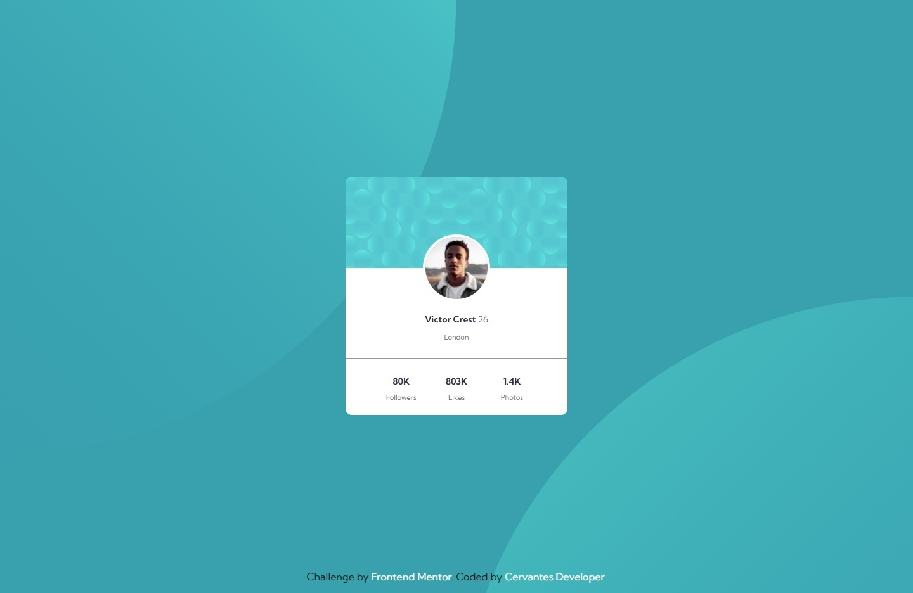

# Frontend Mentor - Profile card component solution

This is a solution to the [Profile card component challenge on Frontend Mentor](https://www.frontendmentor.io/challenges/profile-card-component-cfArpWshJ). Frontend Mentor challenges help you improve your coding skills by building realistic projects. 

## Table of contents

- [Overview](#overview)
  - [The challenge](#the-challenge)
  - [Screenshot](#screenshot)
  - [Links](#links)
- [My process](#my-process)
  - [Built with](#built-with)
  - [What I learned](#what-i-learned)
  - [Continued development](#continued-development)
- [Author](#author)
- [Acknowledgments](#acknowledgments)

**Note: Delete this note and update the table of contents based on what sections you keep.**

## Overview

### The challenge

- Build out the project to the designs provided

### Screenshot

### Links

- Solution URL: [Add solution URL here](https://github.com/cervantesdeveloper/06_fem_profile-card)
- Live Site URL: [Add live site URL here](https://06-fem-profile-card.netlify.app/)

## My process

### Built with

- Semantic HTML5 markup
- CSS custom properties
- Flexbox
- Mobile-first workflow

### What I learned

I learned to how to use the "background-position" property, I spend a lot of time figuring how to posicionating the svg backgrounds.

### Continued development

I need to practice more about background properties.

## Author

- Frontend Mentor - [@cervantesdeveloper](https://www.frontendmentor.io/profile/cervantesdeveloper)
- GitHub - [cervantesdeveloper](https://github.com/cervantesdeveloper)

